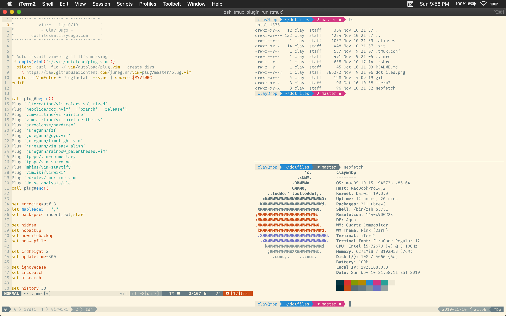
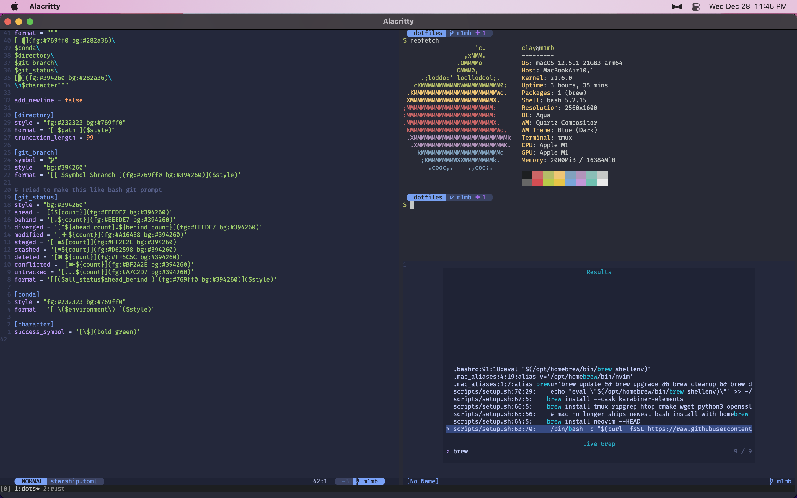

# Dotfiles





My auto-installer is located at `scripts/setup.sh`

```bash

$ tree -a -I '.git|ramona|karabiner'
.
├── .aliases
├── .bashrc
├── .config
│   ├── alacritty
│   │   └── alacritty.yml
│   ├── kitty
│   │   └── kitty.conf
│   ├── MangoHud
│   │   └── MangoHud.conf
│   ├── nvim
│   │   ├── init.lua
│   │   ├── lazy-lock.json
│   │   └── lua
│   │       ├── langserver_icons.lua
│   │       ├── lazy_manager.lua
│   │       ├── maps.lua
│   │       ├── maps_plugin.lua
│   │       ├── options.lua
│   │       └── plugins
│   │           ├── barbecue.lua
│   │           ├── browsher.lua
│   │           ├── copilot.lua
│   │           ├── gitsigns.lua
│   │           ├── lsp.lua
│   │           ├── lualine.lua
│   │           ├── markdown.lua
│   │           ├── mini.lua
│   │           ├── telescope.lua
│   │           ├── tip_of_my_buffer.lua
│   │           ├── tokyonight.lua
│   │           ├── treesitter.lua
│   │           └── vimwiki.lua
│   ├── .ripgreprc
│   ├── starship.toml
│   └── warp-terminal
│       └── keybindings.yaml
├── dotfiles.png
├── dots_macos.png
├── .gitconfig
├── .gitignore
├── .gitmodules
├── .ipython
│   ├── __init__.py
│   └── profile_default
│       └── startup
│           └── 00-conf.py
├── .linux_aliases
├── .local
│   └── bin
│       └── build_nvim.sh
├── .mac_aliases
├── .pre-commit-config.yaml
├── README.md
├── scripts
│   └── setup.sh
├── .tmux.conf
└── .tmux-ssh.conf

15 directories, 43 files
```

#### Dependencies
* [neovim](https://neovim.io/)
* [tmux](https://github.com/tmux/tmux/wiki)
* [starship](https://starship.rs)
* [exa](https://the.exa.website/)

#### Submodules

Clone with submodules:

`git clone --recurse-submodules -j8 git@github.com:claydugo/dotfiles.git`

after cloning:

`git submodule update --init`

after updates

`git submodule update --remote`

#### Old NVIM configurations

[Custom Bubble Theme](https://github.com/claydugo/dotfiles/tree/c3a7fd79d0722f6af88129d9861a21a8f20ef223)

[Switch from init.vim to init.lua](https://github.com/claydugo/dotfiles/commit/9803e70ab5df4f5db7f9da858a3c670d378daf0b)

[Switch from packer.nvim to lazy.nvim](https://github.com/claydugo/dotfiles/commit/00000000a6b60527c21ba36515c93c71869ae253)

