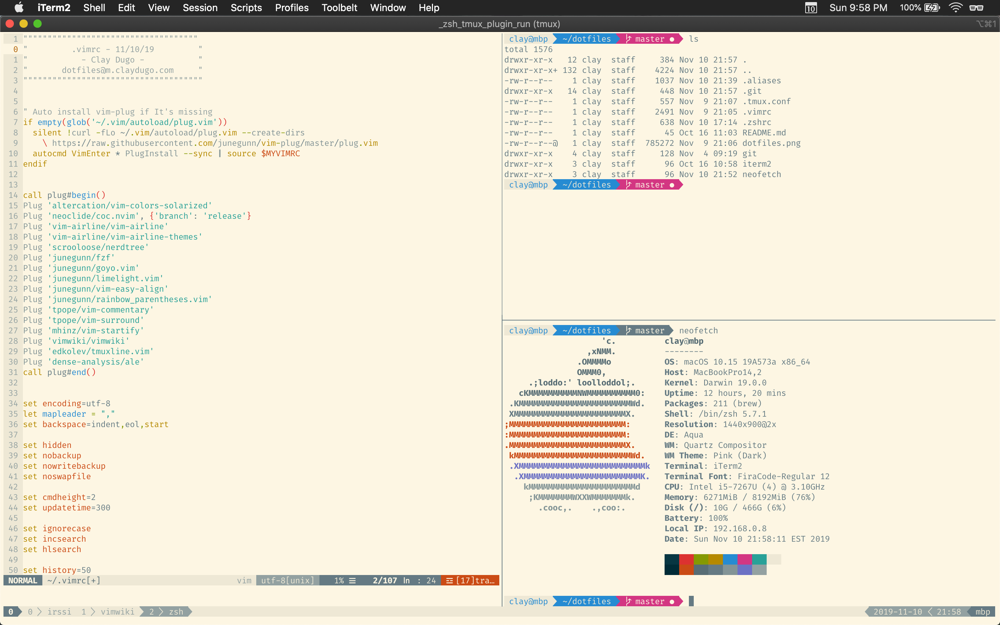

# Dotfiles



## Installation

```bash
git clone --recurse-submodules git@github.com:claydugo/dotfiles.git ~/dotfiles
cd ~/dotfiles
./scripts/bootstrap.sh
```

<details>
<summary>Structure</summary>

```
.
├── .aliases
├── .bashrc
├── .claude
│   ├── commands
│   │   ├── interview.md
│   │   ├── jj.md
│   │   ├── luaist.md
│   │   ├── pythonista.md
│   │   └── remove_slop.md
│   ├── output-styles
│   │   └── direct-action.md
│   └── settings.json
├── .config
│   ├── .ripgreprc
│   ├── alacritty
│   │   └── alacritty.yml
│   ├── ghostty
│   │   └── config
│   ├── jj
│   │   └── config.toml
│   ├── kitty
│   │   └── kitty.conf
│   ├── nvim
│   │   ├── ftplugin
│   │   │   ├── gradle.lua
│   │   │   ├── java.lua
│   │   │   └── lua.lua
│   │   ├── init.lua
│   │   └── lua
│   │       ├── config
│   │       │   └── lazy.lua
│   │       ├── headless_install.lua
│   │       ├── langserver_icons.lua
│   │       ├── maps.lua
│   │       ├── options.lua
│   │       ├── packages.lua
│   │       └── plugins
│   │           ├── blink-cmp.lua
│   │           ├── browsher.lua
│   │           ├── copilot.lua
│   │           ├── dropbar.lua
│   │           ├── gitsigns.lua
│   │           ├── jdtls.lua
│   │           ├── lazydev.lua
│   │           ├── lsp.lua
│   │           ├── lualine.lua
│   │           ├── markdown.lua
│   │           ├── mini.lua
│   │           ├── noice.lua
│   │           ├── telescope.lua
│   │           ├── tip_of_my_buffer.lua
│   │           ├── tokyonight.lua
│   │           ├── treesitter.lua
│   │           └── vimwiki.lua
│   ├── opencode
│   │   └── opencode.json
│   └── starship.toml
├── .gitconfig
├── .gitignore
├── .gitlab_ci_skip
├── .gitmodules
├── .ipython
│   ├── __init__.py
│   └── profile_default
│       └── startup
│           └── 00-conf.py
├── .local
│   └── bin
│       └── build_nvim.sh
├── .luacheckrc
├── .luarc.json
├── .pre-commit-config.yaml
├── .stylua.toml
├── .tmux-ssh.conf
├── .tmux.conf
├── README.md
└── scripts
    ├── bootstrap.sh
    ├── generate_readme.sh
    ├── install_google_sans_code.sh
    └── tmate_restore.py
```

</details>

## Dependencies

Installed via `scripts/bootstrap.sh`:

### Pixi
- `bash`
- `git`
- `nvim`
- `tmux`
- `starship`
- `eza`
- `bat`
- `fzf`
- `ripgrep`
- `fd-find`
- `cmake`
- `make`
- `htop`
- `wget`
- `curl`
- `unzip`
- `openssl`
- `xclip`
- `fswatch`
- `rattler-build`
- `fastfetch`
- `stylua`
- `gifski`
- `jujutsu`
- `hyperfine`
- `tree-sitter-cli`

### Other
- [Pixi](https://pixi.sh/)
- [NVM](https://github.com/nvm-sh/nvm)
- [Kitty](https://sw.kovidgoyal.net/kitty/)
- [Google Sans Code Nerd Font](https://github.com/AliApg/GoogleSansCode-Nerd)

## Submodules

```bash
# After cloning
git submodule update --init

# To update submodules
git submodule update --remote
```
